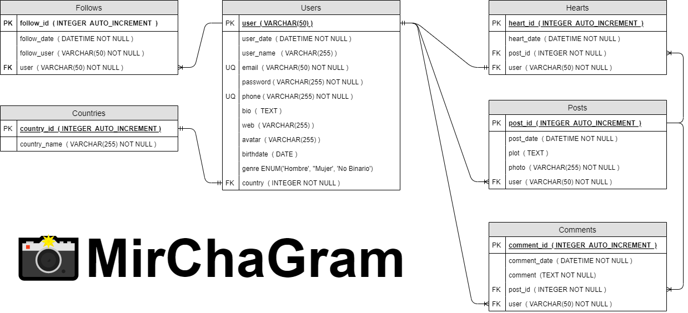

# Lógica de Negocios _MirChaGram_

## Glosario

- **PK** - _Primary Key_
- **FK** - _Foreign Key_
- **UQ** - _Unique_
- **CAT** - _Catalog_
- **1 - 1** - _One to One_
- **1 - M** - _One to Many_
- **M - M** - _Many to Many_

## Modelo Entidad - Relación:

### Entidades:

1. Posts
1. Users
1. Comments
1. Hearts
1. Follows
1. Countries

### Relaciones:

1. Los **Users** publican **Posts** (_1 - M_).
1. Los **Users** escriben **Comments** (_1 - M_).
1. Los **Posts** tienen **Comments** (_1 -M_).
1. Los **Users** otorgan **Hearts** (_1 - 1_).
1. Los **Posts** tienen **Hearts** (_1 - M_).
1. Los **Users** tienen **Follows** (_1 - M_).
1. Los **Users** siguen **Follows** (_1 - M_).
1. Los **Users** tienen un **Countries** (_1 - 1_).

### Atributos:

#### Posts

- post_id (**PK**)
- post_date
- plot
- photo
- user (**FK**)

#### Users

- user (**PK**)
- user_date
- user_name
- email (**UQ**)
- password
- phone (**UQ**)
- bio
- web
- avatar
- birthdate
- genre
- country (**FK**)

#### Comments

- comment_id (**PK**)
- comment_date
- comment
- post_id (**FK**)
- user (**FK**)

#### Hearts

- heart_id (**PK**)
- heart_date
- post_id (**FK**)
- user (**FK**)

#### Follows

- follow_id (**PK**)
- follow_date
- follow_user
- user (**FK**)

#### Countries

- country_id (**PK**)
- country_name

##### Catálogo Countries

- Afganistán
- Albania
- Alemania
- Andorra
- Angola
- Antigua y Barbuda
- Arabia Saudita
- Argelia
- Argentina
- Armenia
- Australia
- Austria
- Azerbaiyán
- Bahamas
- Bangladés
- Barbados
- Baréin
- Bélgica
- Belice
- Benín
- Bielorrusia
- Birmania
- Bolivia
- Bosnia y Herzegovina
- Botsuana
- Brasil
- Brunéi
- Bulgaria
- Burkina Faso
- Burundi
- Bután
- Cabo Verde
- Camboya
- Camerún
- Canadá
- Catar
- Chad
- Chile
- China
- Chipre
- Ciudad del Vaticano
- Colombia
- Comoras
- Corea del Norte
- Corea del Sur
- Costa de Marfil
- Costa Rica
- Croacia
- Cuba
- Dinamarca
- Dominica
- Ecuador
- Egipto
- El Salvador
- Emiratos Árabes Unidos
- Eritrea
- Eslovaquia
- Eslovenia
- España
- Estados Unidos
- Estonia
- Etiopía
- Filipinas
- Finlandia
- Fiyi
- Francia
- Gabón
- Gambia
- Georgia
- Ghana
- Granada
- Grecia
- Guatemala
- Guyana
- Guinea
- Guinea ecuatorial
- Guinea-Bisáu
- Haití
- Honduras
- Hungría
- India
- Indonesia
- Irak
- Irán
- Irlanda
- Islandia
- Islas Marshall
- Islas Salomón
- Israel
- Italia
- Jamaica
- Japón
- Jordania
- Kazajistán
- Kenia
- Kirguistán
- Kiribati
- Kuwait
- Laos
- Lesoto
- Letonia
- Líbano
- Liberia
- Libia
- Liechtenstein
- Lituania
- Luxemburgo
- Madagascar
- Malasia
- Malaui
- Maldivas
- Malí
- Malta
- Marruecos
- Mauricio
- Mauritania
- México
- Micronesia
- Moldavia
- Mónaco
- Mongolia
- Montenegro
- Mozambique
- Namibia
- Nauru
- Nepal
- Nicaragua
- Níger
- Nigeria
- Noruega
- Nueva Zelanda
- Omán
- Países Bajos
- Pakistán
- Palaos
- Panamá
- Papúa Nueva Guinea
- Paraguay
- Perú
- Polonia
- Portugal
- Reino Unido
- República Centroafricana
- República Checa
- República de Macedonia
- República del Congo
- República Democrática del Congo
- República Dominicana
- República Sudafricana
- Ruanda
- Rumanía
- Rusia
- Samoa
- San Cristóbal y Nieves
- San Marino
- San Vicente y las Granadinas
- Santa Lucía
- Santo Tomé y Príncipe
- Senegal
- Serbia
- Seychelles
- Sierra Leona
- Singapur
- Siria
- Somalia
- Sri Lanka
- Suazilandia
- Sudán
- Sudán del Sur
- Suecia
- Suiza
- Surinam
- Tailandia
- Tanzania
- Tayikistán
- Timor Oriental
- Togo
- Tonga
- Trinidad y Tobago
- Túnez
- Turkmenistán
- Turquía
- Tuvalu
- Ucrania
- Uganda
- Uruguay
- Uzbekistán
- Vanuatu
- Venezuela
- Vietnam
- Yemen
- Yibuti
- Zambia
- Zimbabue

## Modelo Relacional de la BD

## Reglas de Negocio

### Posts

1. Crear _post_.
1. Leer todos los _posts_.
1. Leer un _post_.
1. Leer los _post_ de un _user_.
1. Actualizar el _plot_ de un _post_.
1. Eliminar _post_.

### Users

1. Crear _user_.
1. Leer todos los _users_.
1. Leer un _user_.
1. Validar un _user_.
1. Actualizar datos del _user_.
1. Actualizar _password_ de _user_.
1. Eliminar _user_.

### Comments

1. Crear _comment_ en un _post_.
1. Leer todos los _comments_ de un _post_.
1. Leer un _comment_ de un _post_.
1. Contar el número de _comments_ de un _post_.
1. Actualizar el _comment_ de un _post_.
1. Eliminar _comment_ en un _post_.

### Hearts

1. Crear _heart_ de _user_ en un _post_.
1. Contar el número de _hearts_ de un _post_.
1. Eliminar _heart_ de _user_ en un _post_.

### Follows

1. Crear _follow_ de un _user_.
1. Contar el número de _followers_ de un _user_.
1. Contar el número de _followings_ de un _user_.
1. Eliminar _follow_ de un _user_.

### Countries

1. Crear _country_.
1. Leer todos los _countries_.
1. Leer un _country_.
1. Actualizar un _country_.
1. Eliminar _country_.
